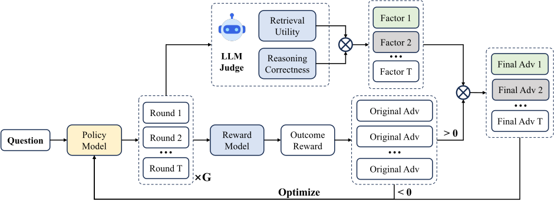
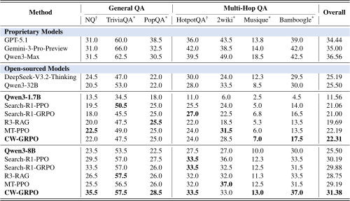

# Enhancing LLM-based Search Agents via Contribution Weighted Group Relative Policy Optimization

> Official implementation of *Enhancing LLM-based Search Agents via Contribution Weighted Group Relative Policy Optimization* (arXiv:2604.14267)

[📄 Paper](https://arxiv.org/abs/2604.14267)

> 🎉 This work has been accepted to the 64th Annual Meeting of the Association for Computational Linguistics (ACL 2026).

> **Note:** This repository is built upon [verl](https://github.com/verl-project/verl) (v0.6.1).



## 🚀 Overview

We propose Contribution Weighted Group Relative Policy Optimization (CW-GRPO), a reinforcement learning framework for training LLM-based search agents.

CW-GRPO integrates process supervision into GRPO by assigning round-level contributions within search trajectories and using them to reweight trajectory-level advantages, enabling finer-grained credit assignment in multi-round search.

Compared to outcome-only or dense process supervision, our method is more stable, efficient, and scalable, especially for long-horizon and multi-hop reasoning tasks.

Experiments show that CW-GRPO outperforms outcome-supervised and process-supervised baselines on the identical backbone.

Main Results:



## 🛠️ Usage

### Installation

To install the local dense retriever environment (for search agent retrieval), run:
```bash
bash examples/sglang_multiturn/search_r1_like/local_dense_retriever/install.sh
```

To install the verl environment for training and evaluation, please refer to the official verl documentation: [Installation Guide (web)](https://verl.readthedocs.io/en/latest/start/install.html) or see the local installation guide at [docs/start/install.rst](./docs/start/install.rst) in this repository.

### Training

```bash
bash examples/sglang_multiturn/search_r1_like/run_qwen3-8b_search_multiturn_cw-grpo.sh # for CW-GRPO
bash examples/sglang_multiturn/search_r1_like/run_qwen3-8b_search_multiturn_grpo.sh # for GRPO
bash examples/sglang_multiturn/search_r1_like/run_qwen3-8b_search_multiturn_ppo.sh # for PPO
bash examples/sglang_multiturn/search_r1_like/run_qwen3-8b_search_multiturn_mt-ppo.sh # for MT-PPO
bash examples/sglang_multiturn/search_r1_like/run_qwen3-8b_search_multiturn_r3-rag.sh # for R3-RAG
```

### Evaluation

Before running the evaluation, please ensure your settings are configured in `examples/sglang_multiturn/search_r1_like/eval/eval_online.yaml`.

The prompt prefix used for evaluation can be customized in `examples/sglang_multiturn/search_r1_like/eval/main_eval_online.py`. Set `use_custom_prompt` to `True` to apply the changes.

To run the evaluation, execute the following commands:
```bash
conda activate verl
python examples/sglang_multiturn/search_r1_like/eval/main_eval_online.py
python examples/sglang_multiturn/search_r1_like/eval/compute_scores.py --input <evaluation-output-file>
```

## 📎 Citation

If you find our work helpful, please cite:
```bibtex
@misc{wang2026enhancingllmbasedsearchagents,
    title={Enhancing LLM-based Search Agents via Contribution Weighted Group Relative Policy Optimization}, 
    author={Junzhe Wang and Zhiheng Xi and Yajie Yang and Hao Luo and Shihan Dou and Tao Gui and Qi Zhang},
    year={2026},
    eprint={2604.14267},
    archivePrefix={arXiv},
    primaryClass={cs.LG},
    url={https://arxiv.org/abs/2604.14267},
}
```
